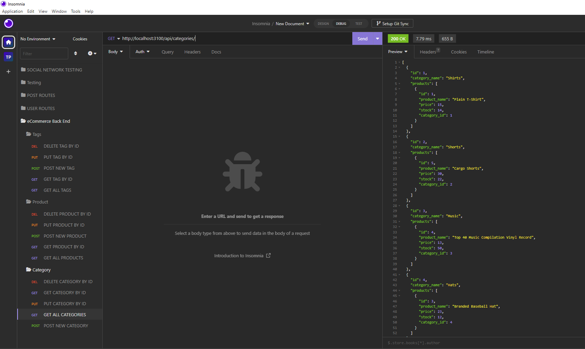

# E-Commerce-Back-End-with-ORM


## Description 

In this project I have completed the back-end system for internet retail companies using Express.js, Sequelize, and MySQL.



-------------------------------------------------------------------------------------------------------------------------------------------------------------------------------------------

If you have found this generator outside of GitHub and wish to view the original, [visit my Repository link here.](https://github.com/tdusenbury/E-Commerce-Back-End-with-ORM)

-------------------------------------------------------------------------------------------------------------------------------------------------------------------------------------------

[Please see the video of the testing of this E-Commerce back-end here!](https://www.veed.io/view/e746f995-3843-494d-8053-9fecd1b02687?panel=share)

## Technology Used 

| [](https://skillicons.dev) 


-------------------------------------------------------------------------------------------------------------------------------------------------------------------------------------------


## Table of Contents

  - [**Description**](#description)
  - [**Installation**](#installation)
  - [**Usage**](#usage)
  - [**Contribution**](#contributing)
  - [**Testing**](#tests)
  - [**Author Info**](#author-info)
  - [**License**](#license)


------------------------------------------------------------------------------------------------------------------------------------------------------------------------------------------

## Installation

In order to run this back-end, clone down the repository from GitHub. Once cloned, run `npm i` to install the stated dependencies. You will also have to create your own .env file for user id, name, and password. Then run `mysql -u root-p`, enter your password, and run `SOURCE db/schema.sql` to load your databases. Exit MySQL and return to terminal and type `npm run seed` to seed the database. Now you can type `npm run start` to connect to the server and view, add, or delete the contents of the database.


-------------------------------------------------------------------------------------------------------------------------------------------------------------------------------------------
## Usage 

This is an example of the basic back-end needed to run an e-commerce business. A developer could easily use this as starter code to create what their client needs for their personal business.


-------------------------------------------------------------------------------------------------------------------------------------------------------------------------------------------

## Learning Points

This project involved a lot of data entry, but gave me a greater understanding of routes and models. I did not really understand how to use insomnia to test my routes. I really appreciate having this tool.

Here is a snippet of the code used to show the relationships between the database tables:

```
Product.belongsTo(Category, {
  foreignKey: 'category_id',
});

Category.hasMany(Product, {
  foreignKey: 'category_id',
  onDelete: 'CASCADE',
});

Product.belongsToMany(Tag, {
  through: {
    model: ProductTag,
  } 
});

Tag.belongsToMany(Product, {
  through: {
    model: ProductTag,
  } 
})
```

## Testing
The restful API routes of this application were all tested using Insomnia. The video shows that all routes for Category, Product, and Tag were tested for successful `GET`, `POST`, `PUT`, and `DELETE`.

-------------------------------------------------------------------------------------------------------------------------------------------------------------------------------------------

## Author Info
My name is Tamara "T" Dusenbury
If you have any questions about me or this project, please contact me:
  
- [**Github**](https://github.com/tdusenbury)

- [**LinkedIn**](https://linkedin.com/in/tamara-dusenbury-02ab8591)

- [**Email**](mailto:tamara.dusenbury@gmail.com)


-------------------------------------------------------------------------------------------------------------------------------------------------------------------------------------------
## Credits

Shout outs to the cohort and study group!!! We made it half-way!!!!

-------------------------------------------------------------------------------------------------------------------------------------------------------------------------------------------

## Contributing

If you would like to contribute, please follow the [Contributor Covenant](https://www.contributor-covenant.org/).

[](code_of_conduct.md)

-------------------------------------------------------------------------------------------------------------------------------------------------------------------------------------------

## License

This projects holds an MIT License.